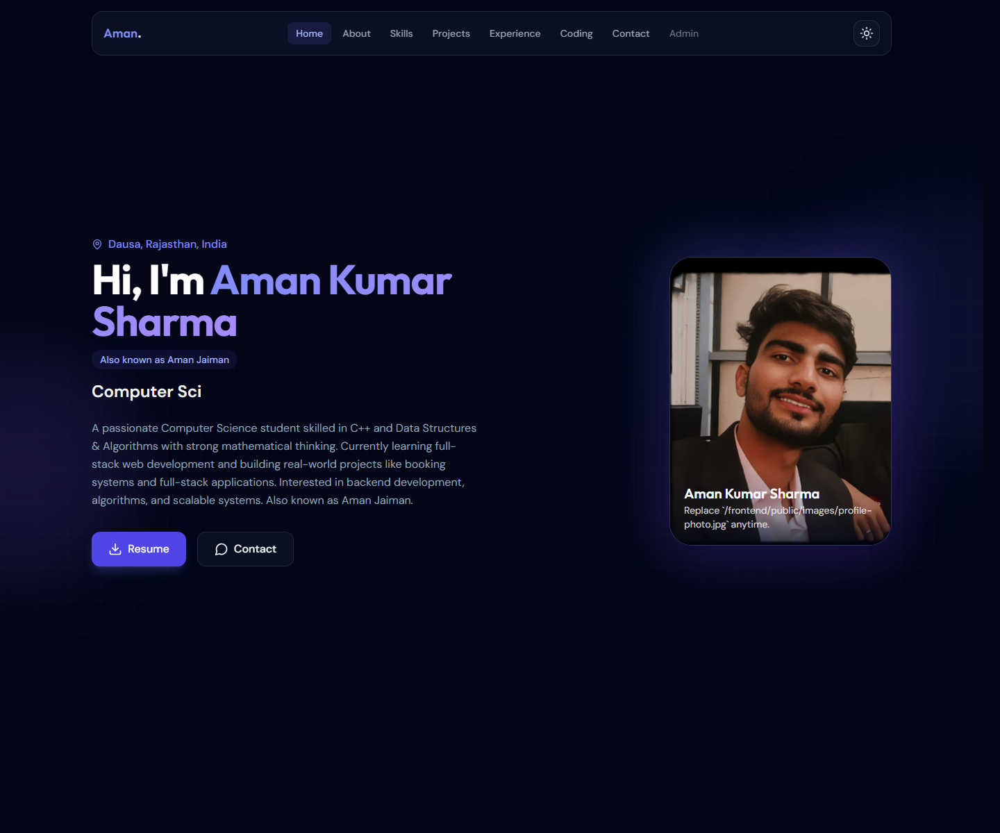

# Aman Kumar Sharma Portfolio

Full-stack personal portfolio for **Aman Kumar Sharma** (also known as **Aman Jaiman**), built with **React + Tailwind CSS** on the frontend and **Node.js + Express + MongoDB** on the backend.

## Screenshots

### Home


### Coding Profiles


### Contact


## Highlights

- Responsive personal portfolio with hero, about, skills, projects, experience, coding profiles, and contact sections.
- Replaceable profile photo stored at `frontend/public/images/profile-photo.jpg`.
- Automatic fallback to `frontend/public/favicon.svg` if the profile photo is missing or fails to load.
- Resume download support from `frontend/public/resume.pdf`.
- GitHub stats, contribution graph, and live LeetCode progress card.
- Contact form saves messages to MongoDB and can send email notifications through SMTP.
- Admin page for managing projects and viewing stored contact messages.

## Coding Profiles

- GitHub: [Aman-Jaiman](https://github.com/Aman-Jaiman)
- LeetCode ID: [Aman_Jaiman__](https://leetcode.com/u/Aman_Jaiman__/)
- LinkedIn: [aman-sharma-67b517376](https://www.linkedin.com/in/aman-sharma-67b517376/)
- Instagram: [aman_jaiman__](https://www.instagram.com/aman_jaiman__)
- Email: [amanjaiman0010@gmail.com](mailto:amanjaiman0010@gmail.com)

### Live LeetCode Card


## Tech Stack

- Frontend: React, Vite, Tailwind CSS, Framer Motion, Axios
- Backend: Node.js, Express, Mongoose, Nodemailer
- Database: MongoDB Atlas

## Local Setup

### Frontend

```bash
cd frontend
npm install
npm run dev
```

### Backend

```bash
cd backend
npm install
npm run dev
```

Detailed setup notes are available in [SETUP.md](./SETUP.md).

## Environment Notes

Backend `.env` values you may want to configure:

- `MONGODB_URI`
- `ADMIN_TOKEN`
- `CORS_ORIGIN`
- `SMTP_HOST`
- `SMTP_PORT`
- `SMTP_SECURE`
- `SMTP_USER`
- `SMTP_PASS`
- `CONTACT_NOTIFICATION_EMAIL`

Frontend `.env` values:

- `VITE_API_URL`
- `VITE_GITHUB_USERNAME`

## Customization

- Replace the profile image by updating `frontend/public/images/profile-photo.jpg`.
- Keep `frontend/public/favicon.svg` in place for the default avatar fallback.
- Replace `frontend/public/resume.pdf` with the latest resume file when needed.
- Update personal links in `frontend/src/data/profile.js`.

## Project Structure

```text
Portfolio/
|-- frontend/
|   |-- public/
|   |-- src/
|-- backend/
|   |-- config/
|   |-- controllers/
|   |-- middleware/
|   |-- models/
|   |-- routes/
|   |-- services/
|-- docs/
|   |-- screenshots/
|-- README.md
|-- SETUP.md
```
